@dasilvaEffectAdhesiveType2006

## Experiment
Three adhesives are selected: a very ductile adhesive (Hysol EA 9361), a very brittle adhesive (Araldite AV138/HV998), and an intermediate adhesive (Hysol EA 9321).

### Buckle adhesive specimen tensile test
Dogbone plate specimens of the 3 adhesives are used for tensile test. Shpae of dogbone specimen is shown in the figure below. MTS machine is used under a crosshead speed of 1mm/min. The strain is measured using optical method.
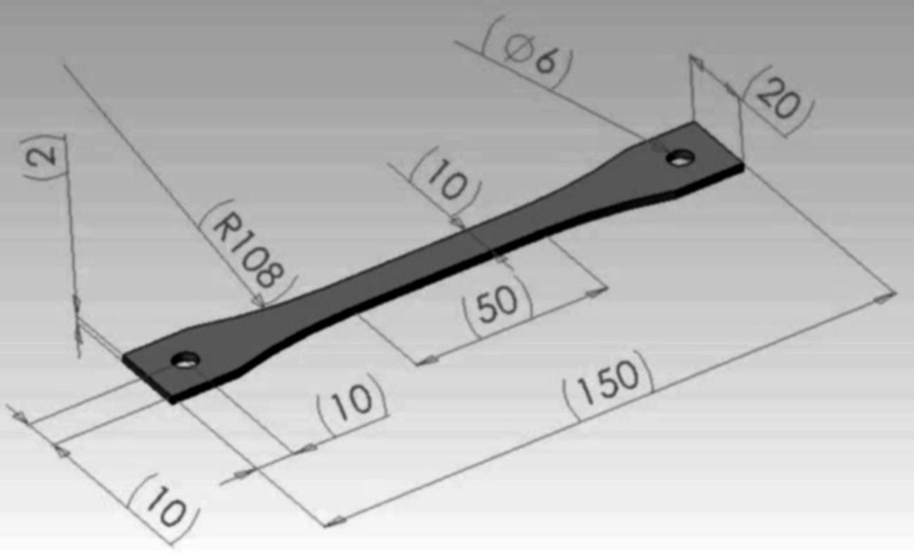

Typical stress-strain curves of the adhesives are shown below. And the mechanical properties of the adhesives are shown in the table below.
The brittle adhesive (AV138/HV998) presents more scatter than the others because it's more sensitive to defects. The yield strength is calculated for a plastic deformantion of 0.2%. The area under the stress-strain curve ($U_T$) is an approximate value of the toughness. $U_T$ can be calculated as equtions below:
$$
\begin{aligned}
U_T &= \left(\frac{\sigma_{ya}+\sigma_r}{2}\right)\epsilon_f \quad (\text{ductile})\\
U_T &= \frac{2}{3}\sigma_r\epsilon_f \quad (\text{brittle})
\end{aligned}
$$
where $\sigma_{ya}$ is the yield strength of the adhesive, $\sigma_r$ is the ultimate tensile strength, and $\epsilon_f$ is the failure strain.
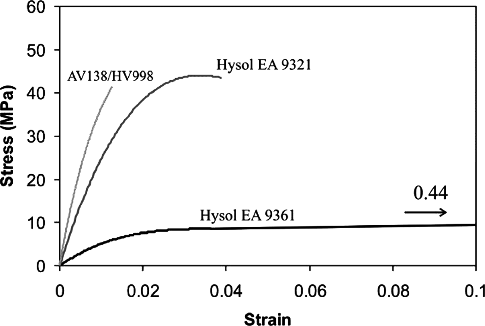

| Parameter                          | Hysol EA 9361 (ductile) | Hysol EA 9321 (intermediate) | AV138/HV998 (brittle) |
|------------------------------------|-------------------------|------------------------------|-----------------------|
| Young's modulus $E$ (GPa)          | 0.67 $\pm$ 0.02         | 3.87 $\pm$ 0.15              | 4.59 $\pm$ 0.81       |
| Poisson's ratio $\nu$              | 0.4                     | 0.36                         | 0.35                  |
| Yield strength $\sigma_{ya}$ (MPa) | 4.32 $\pm$ 0.55         | 21.99 $\pm$ 2.16             | 36.49 $\pm$ 2.47      |
| Tensile strength $\sigma_r$ (MPa)  | 7.99 $\pm$ 1.59         | 45.97 $\pm$ 0.09             | 41.01 $\pm$ 7.28      |
| Failure strain $\epsilon$ (%)      | 44.0 $\pm$ 12.3         | 3.8 $\pm$ 0.03               | 1.3 $\pm$ 0.44        |
| Toughness $U_T$                    | 2.69                    | 1.16                         | 0.34                  |

### SLJ shear test
To quantify separately the influence of the adhesive thickness and the type of adhesive on the lap shear strength, an experimental array of tthree levels with nine experimental runs is designed as shown in the table below. Every entry in this table is repeated 6 times.

| Experimental run | Type of adhesive | Adhesive thickness (mm) |
|------------------|------------------|:-----------------------:|
| 1                | AV138            |           0.2           |
| 2                | AV138            |           0.5           |
| 3                | AV138            |           1.0           |
| 4                | EA9321           |           0.2           |
| 5                | EA9321           |           0.5           |
| 6                | EA9321           |           1.0           |
| 7                | EA9361           |           0.2           |
| 8                | EA9361           |           0.5           |
| 9                | EA9361           |           1.0           |

The SLJs have and overlap of 25mm and a width of 25mm, and the geometry is shown below. To maintain the adherends in elasticity, a high-strength steel (DIN C60) is choosen. The overlap length is chosen according to a simple methodology proposed by Adams and Davies, to ensure the adherends wouldn't yield. According to this methodology the overlap length shall not exceed 60mm.
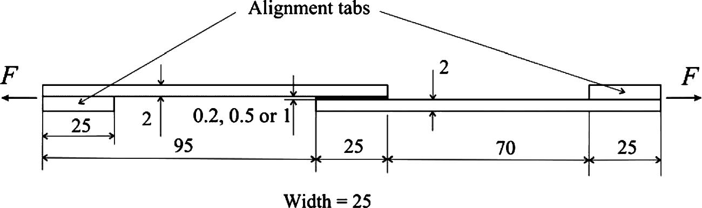

### Lap shear strength results
The experimental failure loads of the SLJ specimens are shown in the figures below. The joint strength of the ductile adhesive decreases as the bondline thickness increases, this holds for the intermediate adhesive. For brittle adhesive, the joint strength increases from 0.2 to 0.5 and decreases from 0.5 to 1mm. Besides, data of this adhesive presents an important dispersion with bondline thickness of 0.2 and 0.5. This because brittle adhesives are very sensitive to defects such as voids and microcracks. Anyway, from 0.5 to 1mm, there is apparent decrease in strength with increase of bondline thickness, contradicting with elastic prediction which should be applicable to very brittle adhesives. Therefore, the joint strength cannot be solely explained by the plastic behavior of the adhesive.
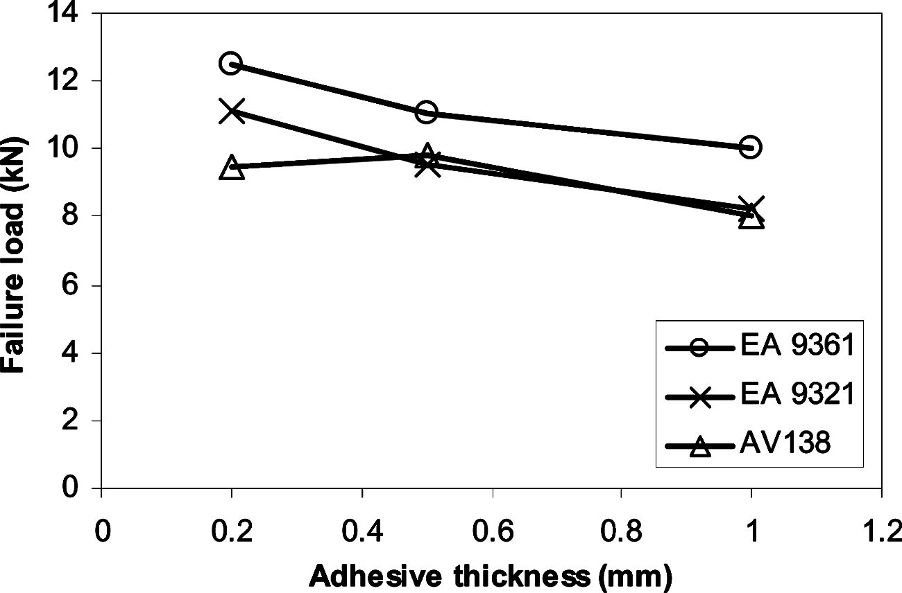
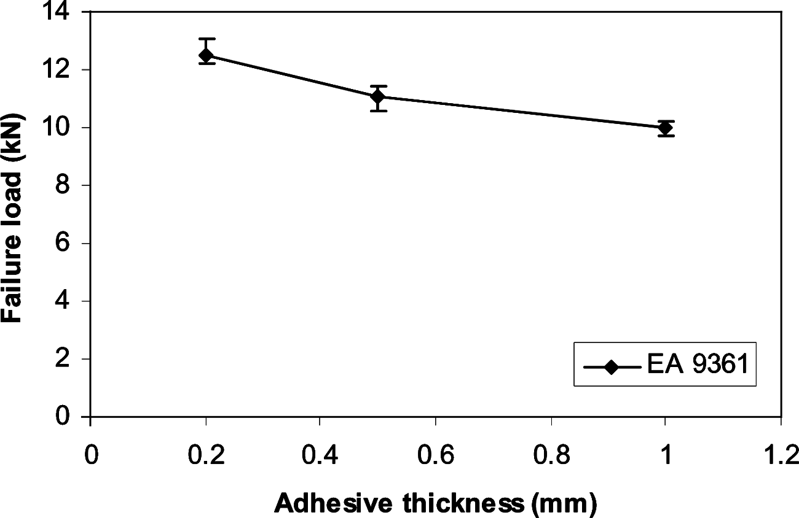
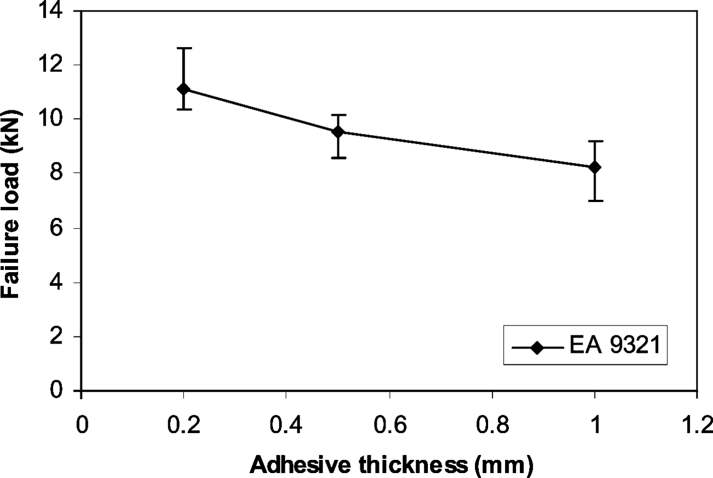
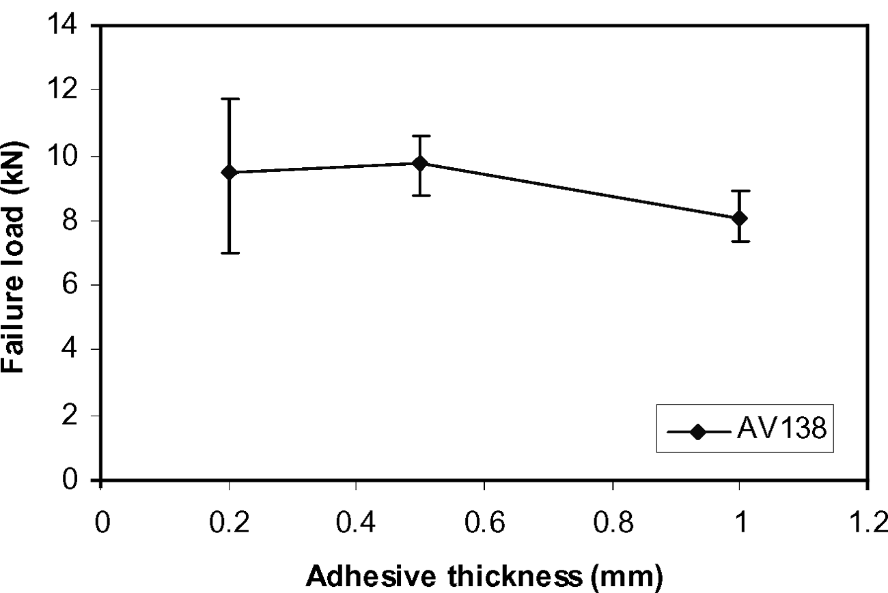

Below is the figure of fracture surface of a SLJ, from which we can see the failed joints all have cohesive failure, but very close to the interface.
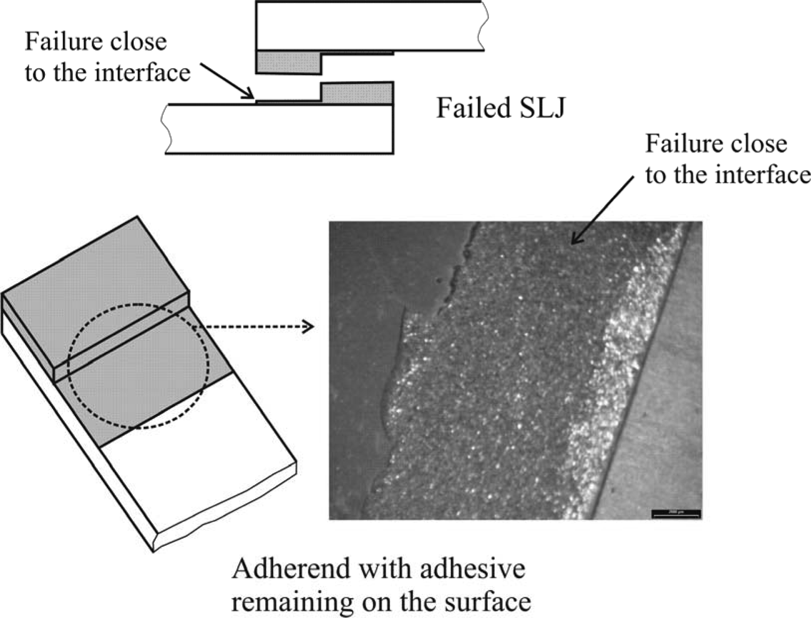

The load-displacement curves are shown below. The curves for the intermediate and brittle adhesives are very similar, because in both cases the adhesive deformantion is negligible comparing with that of steel. Howerver, the curve for the ductile has an obvious twist, deviding the curve into 2 region. The second region with a lower slope is probaly due to the plastic deformation of the adhesive, but this would mean that the joint with thinner bondline started to deform plastically at a higher load than those with thicker bondline, which contradicts with a plastic FE analysis. Also, the slope decreases as the bondline increases, meaning the joint becoming more flexible.
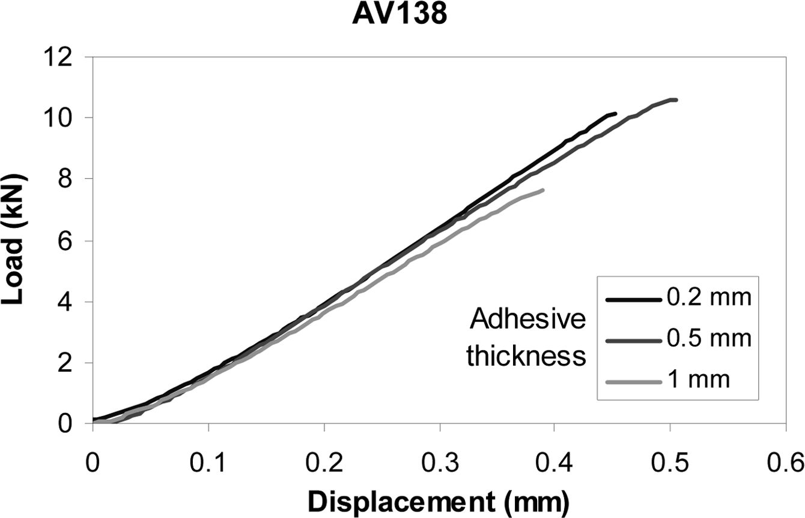
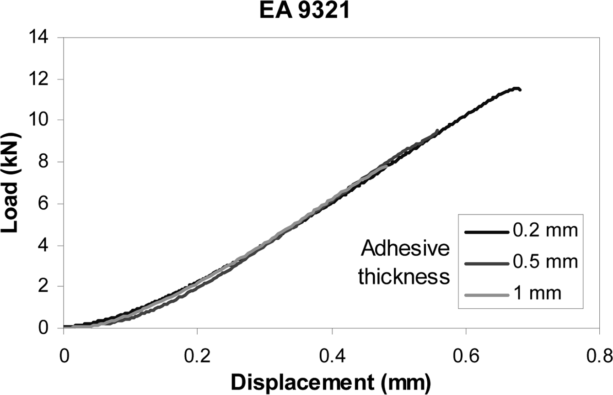
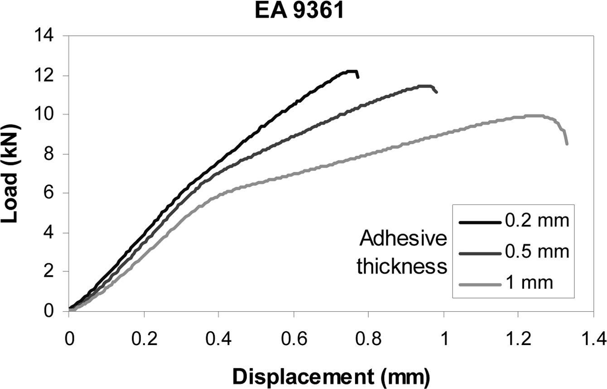

