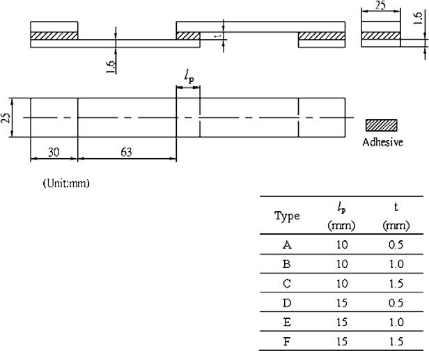
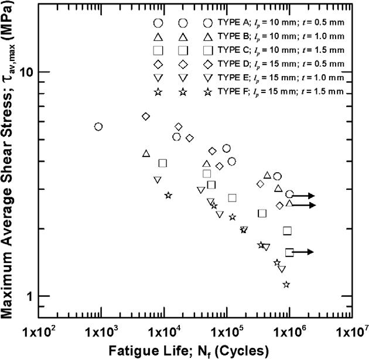
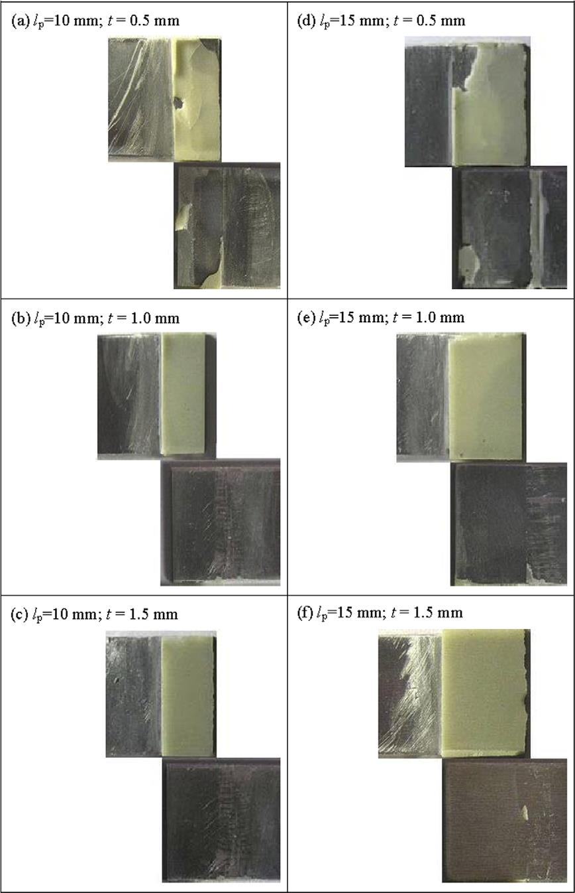
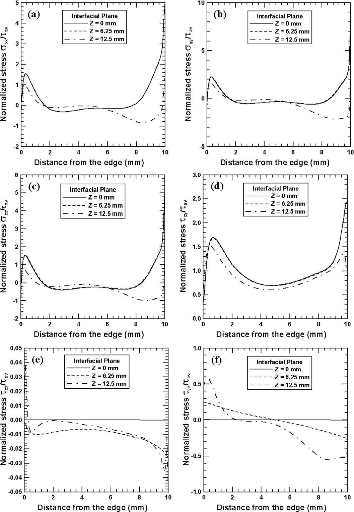
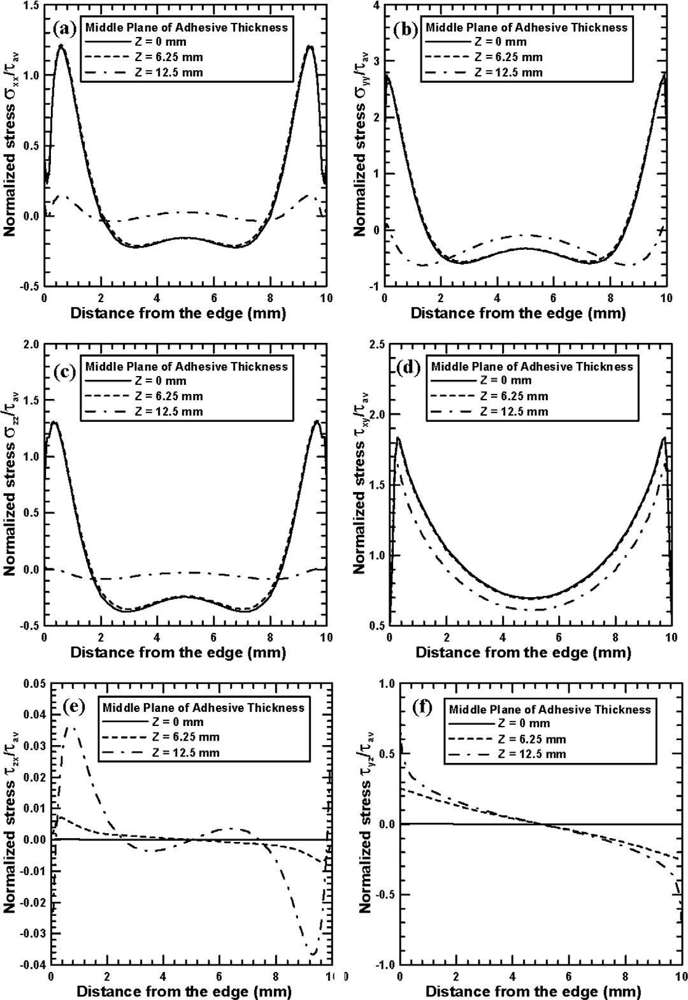
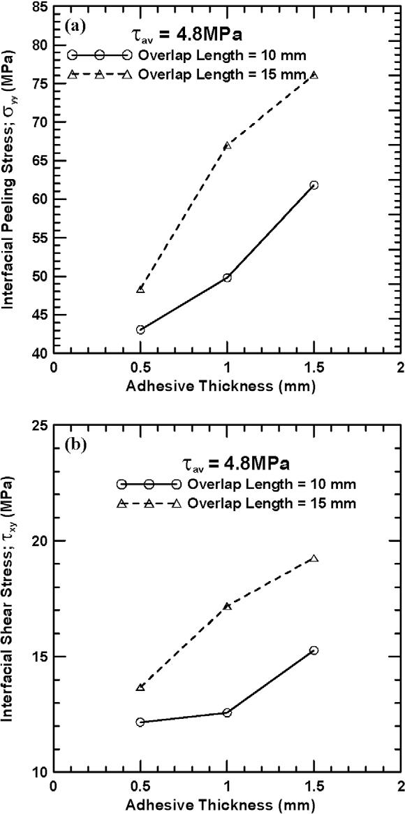
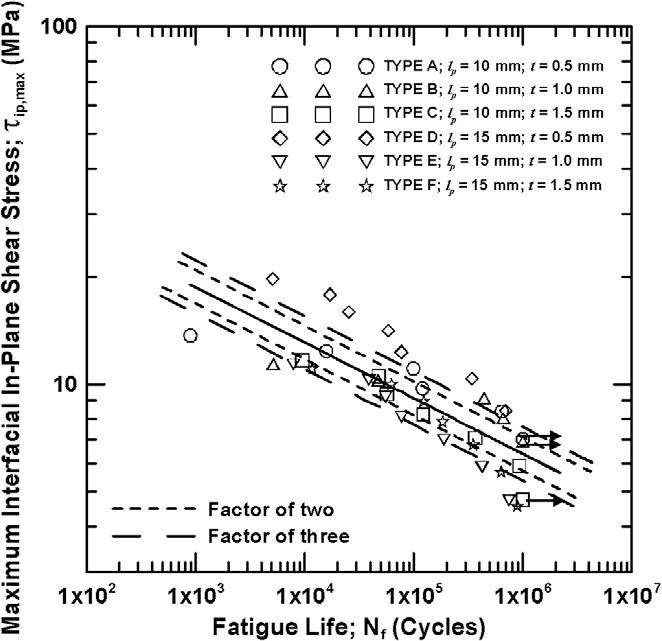
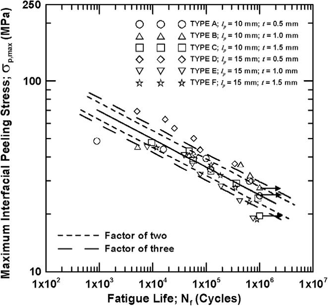
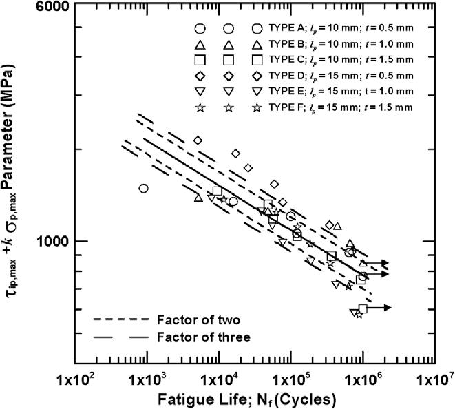

@jenEvaluationFatigueLife2010
## Test preparations
6 types of SLJ specimens with various overlap lengths and adhesive thickness are designed for fatigue tests. Geometry and material properties of the specimens are listed in the table below.

Shape and dimensions of the SLJ specimens
| Type | $l_p$(mm) | $t$(mm) |
|------|-----------|---------|
| A    | 10        | 0.5     |
| B    | 10        | 1.0     |
| C    | 10        | 1.5     |
| D    | 15        | 0.5     |
| E    | 15        | 10      |
| F    | 15        | 1.5     |

Material properties of adherends and adhesive
| Materials         | Young's modulus(GPa) | Poison ratio | Yield strenth(MPa) | Tensile Strength(MPa) | Elongation | BHN |
|-------------------|----------------------|--------------|--------------------|-----------------------|------------|-----|
| Aluminum 5052-H32 | 75.8                 | 0.37         | 151.0              | 228.0                 | 14.5%      | 62  |
| Epoxy             | 2.43                 | 0.41         | -                  | 22.0                  | 1.4%       | -   |

Static tensile tests are performed to get the ultimate loads of specimens, which are listed below.

Ultimate loads in the static tensile tests
| Specimen type     | A       | B       | C       | D       | E       | F       |
|-------------------|---------|---------|---------|---------|---------|---------|
| Ultimate loads(N) | 2858.88 | 2169.24 | 1957.10 | 4749.61 | 2468.68 | 2113.26 |

The loading ratio($F_\mathrm{min}/F_\mathrm{max}$) is 0.1 for all tests. Loading wave form is sinusoidal and frequency 3Hz.

## Test results
The fatigue life of all specimens under different load levels are listed below.

| Load level | Type A   | Type B   | Type C   | Type D | Type E | Type F |
|------------|----------|----------|----------|--------|--------|--------|
| 50         | 894      | 5161     | 9502     | 5096   | 7836   | 11692  |
| 45         | 15815    | 47420    | 47743    | 16987  | 38783  | 62443  |
| 40         | 98837    | 439820   | 56591    | 25478  | 55110  | 122951 |
| 35         | 119890   | 661608   | 121933   | 58690  | 77315  | 184109 |
| 30         | 640620   | >1000000 | 365489   | 76532  | 188038 | 349370 |
| 25         | >1000000 | -        | 926707   | 342646 | 421345 | 632433 |
| 20         | -        | -        | >1000000 | 695842 | 748956 | 887152 |

The figure below shows the relationship between the maximum average shear stress $\tau_\mathrm{av,max}$ and the fatigue life of the specimens. The maximum average shear stress is defined as the maximum applied force devided by the lap area. It can be found that:
- Under fixed applied average shear stress, the fatigue strength decreases as the adhesive thickness increases.
- For specimens with adhesive thickness of 1.0 and 1.5mm, fatigue strength decreases as the overlap length increases. But for specimens with adhesive thickness of 0.5, fatigue strength seems independent of overlap length.

Below is the fractographies of specimens after fatigue tests. Almost no adhesive remains on the fracture surface of adherends, indicating that the adhesive failure mode is predominant. It also implies that **local interfacial stress** can be used to evaluate the fatigue life of specimens with different adhesive dimensions.

## FEM simulation
The three-dimension FEM is employed to obtain the local stress state of interfaces between adherends and adhesive.The property of aluminum adherends is elastic-plastic and property of adhesive to be linearly elastic for its brittle behavior. The von Mises yield criterion and multi-linear kinematic hardening rule is used in non-linear analysis.

## FEM results
Below are the FE simulated stress components on the interfacial plane($Y$=0.25mm) and middle plane($Y$=0mm) of a type A specimen. The stress components are normalized by the applied average shear stress $\tau_\mathrm{av}$.

Figure below shows the effect of adhesive dimensions on the normalized interfacial peeling stress $\sigma_{yy}$ and shear stress $\tau_{xy}$ respectively, when the average shear stress is fixed at 4.8MPa. It can be seen both the interfacial peeling stress and shear stress increase with adhesive thickness for a fixed overlap length and increase with overlap length for a fixed adhesive thickness.

## Correlation performance of the interfacial parameters
Three interfacial parameters are employed to correlate the fatigue life of specimens, which are maximum interfacial peeling stress $\sigma_\mathrm{p,max}$, maximum interfacial shear stress $\tau_\mathrm{ip,max}$ and a linear combination of them. The formal 2 parameters are given by
$$
\begin{aligned}
\sigma_\mathrm{p,max}&=\sigma_{yy} \\
\tau_\mathrm{ip,max}&=\sqrt{{\tau_{xy,\mathrm{max}}}^2+{\tau_{yz,\mathrm{max}}}^2} \\
\end{aligned}
$$
and the last parameter can be expressed as $\tau_\mathrm{ip,max}+k\sigma_\mathrm{p,max}$, where $k$ is a constant to be determined experimentally.

Figures below present the correlation results of the three employed interfacial parameters with the experimental fatigue data points of the specimens with different adhesive dimensions.

Table below shows the simulated values of three interfacial parameters and their average values, standard deviation and coefficients of variation(which is defined as the ratio of standart deviation to the average value).

| Employed parameter                                                   | A      | B      | C      | D       | E      | F      | Avg. value(MPa) | Standard deviation(MPa) | Coeff. of variation(%) |
|----------------------------------------------------------------------|--------|--------|--------|---------|--------|--------|-----------------|-------------------------|------------------------|
| Max. peeling stress;$\sigma_{p,\mathrm{max}}$(MPa)                   | 96.58  | 88.78  | 94.26  | 137.98  | 86.65  | 86.29  | 98.42           | 19.82                   | 20.14                  |
| Max. in-plane shear stress;$\tau_{ip,\mathrm{max}}$(Mpa)             | 27.89  | 23.04  | 23.99  | 41.65   | 22.68  | 22.09  | 26.89           | 7.52                    | 27.96                  |
| Combined parameter;$\tau_{ip,\mathrm{max}}+k\sigma_{p,\mathrm{max}}$ | 946.85 | 791.59 | 826.14 | 1408.19 | 778.27 | 760.34 | 918.51          | 249.01                  | 27.11                  |

The coefficients of determination-R squared for 3 correlation results are 0.701, 0.643 and 0.701 respectively. The results of the regression study show that the maximum peeling stress and the linear combination of 2 interfacial maximum stresses yield slightly better correlation results than the maximum shear stress parameter.

## Conclusions
1. Under fixed average shear stress, the fatigue strength increases with decreasing adhesive thickness and increase with decreasing overlap length except for the specimens with adhesive thickness of 0.5mm.
2. The maximum average shear stress parameter fails to correlate with fatigue life, because the bulk parameter cannot account for the effect of local interfacial stress, which, from the observation of failure surfaces, is the predominant reason for the fatigue failure.
3. The interfacial peeling stress is the main driven force of the debonding under fatigue loading.
